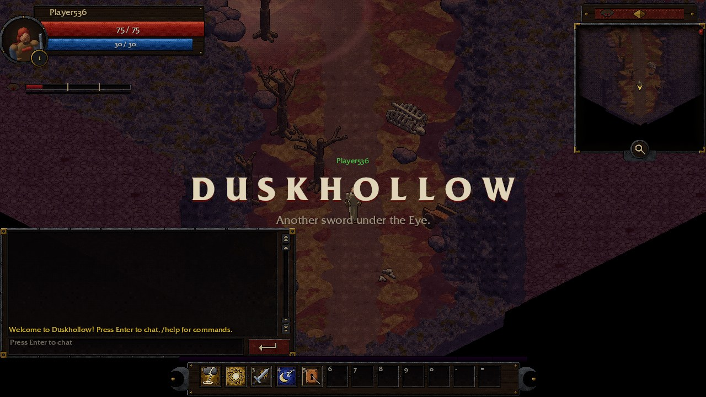
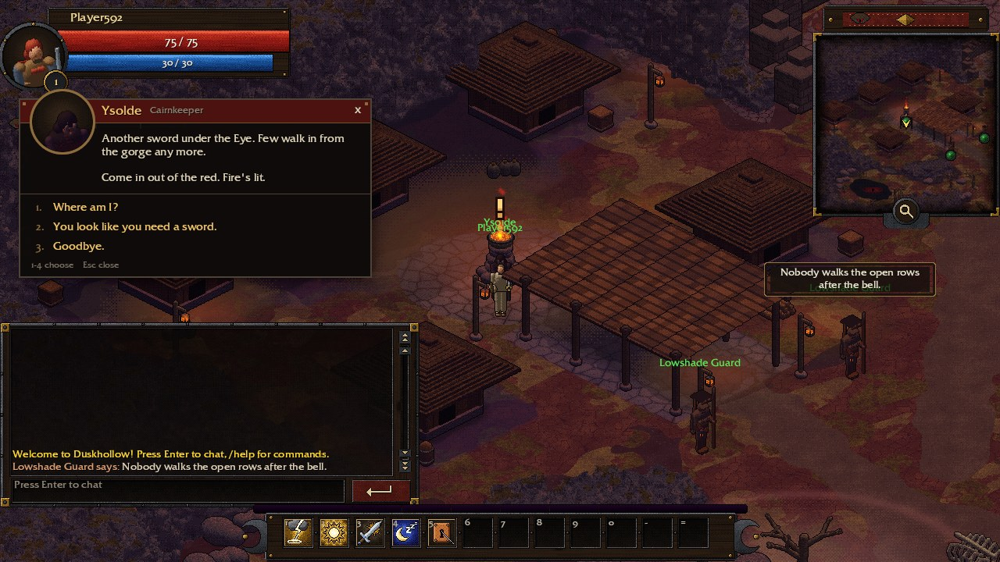
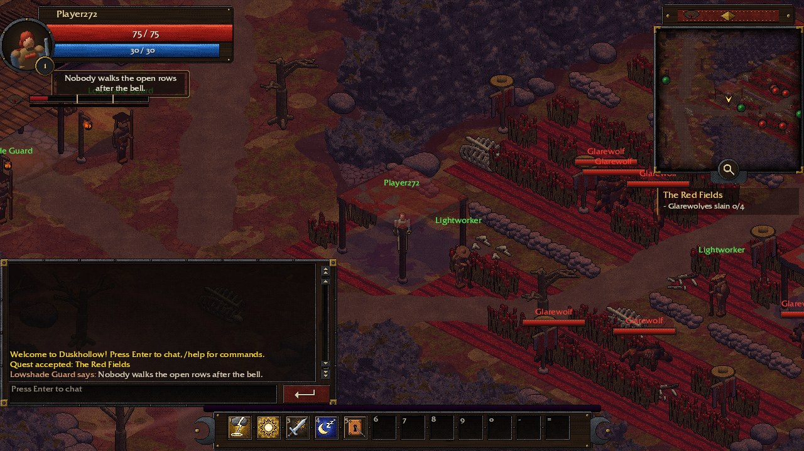
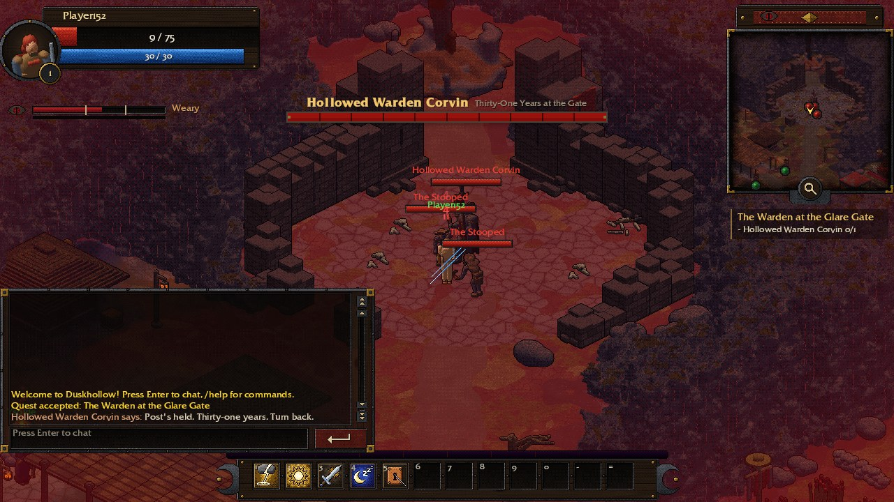

# Duskhollow

An isometric online ARPG in Rust + [Bevy](https://bevyengine.org/), with its own authoritative
server, procedurally generated oldschool pre-rendered art and an original soundtrack.

The engine reads a legacy data pack (`game.db`, `.map` files, sprite archives; formats in
[docs/formats.md](docs/formats.md)) that is **not** distributed here. Everything under
`custom_assets/` (sprites, portraits, tiles, icons, UI skin, spell effects, music, the
`custom_glade` and `custom_duskhollow` maps) is original and progressively replaces legacy
visuals with `--art custom`.



## First Gaze (demo)

A crimson sky, a rift, and an Eye that never shuts ([world bible](docs/world.md),
[demo plan](docs/demo-plan.md)). You are an Ender, one of the few who can stand its gaze for a
while: strain builds under open sky and faster in a fight, shade and roofs slow it, rest cairns
clear it. Help Ysolde of Lowshade with the glarewolves in the Red Fields, then put Warden Corvin
to rest at the Glare Gate while the Eye opens wide.

```bash
cargo run -p dusk_client -- custom_duskhollow --art custom
```

| | |
|---|---|
|  |  |
| Lowshade: Ysolde at the rest cairn | The Red Fields: canopies are the only shade |



## Setup

```bash
# 1. Unpack a legacy data pack into ./assets
cargo run -p dusk_extract --release -- <DATA_DIR>

# 2a. Offline: the client runs the server embedded (optionally pick a start map / class 1-4)
cargo run -p dusk_client
cargo run -p dusk_client -- goblin_cave --class 2

# 2b. Online: start the server, then any number of clients
cargo run -p dusk_server
cargo run -p dusk_server -- --start-map goblin_cave   # optional: different start map
cargo run -p dusk_client -- --connect 127.0.0.1:16383 --name Alice

# Headless bot: joins, pathfinds to the nearest attackable NPC and fights
# (DUSK_AUTOPLAY=1 makes the GUI client do the same)
cargo run -p dusk_protocol --example bot
# Headless run of the demo quests (server on a map with Ysolde, glarewolves and a glare_gate marker)
cargo run -p dusk_protocol --example quest_bot
```

Controls: `WASD` move, left-click an enemy to target it (spells land on it, no walking), right-click or double-click to walk up and auto-attack, `Tab` / `Shift+Tab` cycle nearby enemies, `1`-`0` `-` `=` cast from the action bar, `P` Abilities window (click a spell, then a slot to place it; right-click a slot to clear), `J` quest journal (Track / Untrack feeds the tracker under the minimap; click a tracked quest to open it), `Esc` does one thing per press: cancel the chat input > cancel the cast > close the most recently opened window > close the dialogue > clear the target (then the pause menu), `Enter` chat (`Enter` send, `Esc` cancel, `/help`), mouse wheel over chat / minimap scrolls / zooms, numpad `+`/`-` minimap zoom, `M` toggle music, `N` toggle sound effects, `I` Inventory (click gear to equip, potions to drink; shift + right-click destroys), `C` Character window (General / Combat / Skills tabs; click a slot to unequip). The micro-menu at the bottom right opens the same windows; windows come to the front when clicked and can be dragged by their title bar (positions kept for the session), left-click a corpse with a pouch over it to loot. Click (left or right) a friendly NPC to walk up and talk: `1`-`4` or click picks a reply, `Esc` closes.

Debug aids (env vars): `DUSK_SCREENSHOT=out.png` (+ `DUSK_SCREENSHOT_AT=secs`), `DUSK_AUTOPLAY=1`, `DUSK_OPEN_BOOK=1`, `DUSK_TOOLTIP_SLOT=n`, `DUSK_OPEN=character,inventory,abilities,journal` (+ `DUSK_OPEN_AT=secs`), `DUSK_ESC=n` (press `Esc` n times from `DUSK_ESC_AT`, logging what each did), `DUSK_CHAR_TAB=combat|skills`, `DUSK_HINT=<hint title>`, `DUSK_LOW_HP_TEST=1`, `DUSK_CHAT=text` (say `text`, then leave it typed in the input). Demo director: `DUSK_DIALOGUE_TEST=<npc entry>` (walk up and talk), `DUSK_QUEST_TEST=<stage>` (start the run at `wolves[:N]`, `wolves_ready`, `warden_offered`, `warden`, `warden_ready` or `end`), `DUSK_BOSS_TEST=1`, `DUSK_TITLE_TEST=1`, `DUSK_END_TEST=1`.

## Workspace

| Crate | Role |
|---|---|
| `dusk_formats` | Engine-agnostic parsers: `.map`, sprite scripts, `.sa`, `.psi` (+ simulation), `game.db` |
| `dusk_extract` | Unpacks the install into `assets/` + builds `file_index.txt` |
| `dusk_client` | Bevy client (rendering, input, UI) |
| `dusk_protocol` | Client/server messages, framing, TCP transport |
| `dusk_server` | Authoritative server (lib + bin): maps, NPC AI (wander/aggro/chase/leash), melee combat, XP, respawn |

Own art: `tools/artgen` generates oldschool pre-rendered sprites (`cargo run -p dusk_client -- --art custom`), see [tools/artgen/README.md](tools/artgen/README.md).

File format notes: [docs/formats.md](docs/formats.md). Combat rules and recovered enums: [docs/combat.md](docs/combat.md). Music, ambience and sound effects: [docs/audio.md](docs/audio.md). HUD layout (unit frames, chat, name plates, minimap): [docs/ui.md](docs/ui.md).

## Roadmap

1. ✅ Asset extraction, format parsers, map + NPC + paper-doll rendering, WASD movement
2. ✅ Map terrain + walk flags (Ghidra), `.psi` particles (map sprites, spell kits), `sprite_light` glows + zone darkness. Next: clouds overlay, unit/spell glows
3. ✅ `dusk_protocol` + networking; server owns NPC spawns, wandering, validates movement
4. 🟡 Combat: ✅ melee, aggro/leash, death/respawn, XP/levels, HUD, spells (casts, cooldowns, damage/heal/weapon/aura effects, NPC casting), action bar, Abilities window, tooltips, `.sa` spell visuals, kit particles, sounds — next: remaining effect types, spell ranks
5. 🟡 Items: ✅ item templates, inventory, equipment + stats, paper doll, starting gear, potions, NPC loot (tables, junk, random affixed gear, gold), loot window — next: vendors, sockets/gems, durability, persistence ([docs/items.md](docs/items.md))
6. 🟡 UI: ✅ unit frames with portraits (elite/boss rings), XP bar, chat + speech bubbles, name plates, minimap — next: full-screen map, party frames, chat channels, quests, gossip, `.bscript` buttons
7. ✅ Audio: zone/area/map music + ambience with crossfades, melee/spell/NPC-voice/UI sound effects, sprite proximity loops, volume keys — next: footsteps, item/object sounds, stereo panning
8. Persistence (characters), parties, guilds, arena, dungeons
